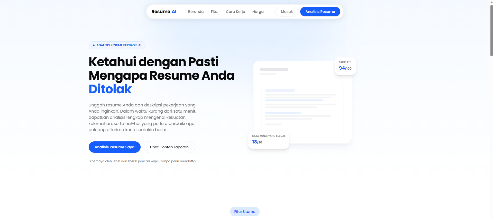
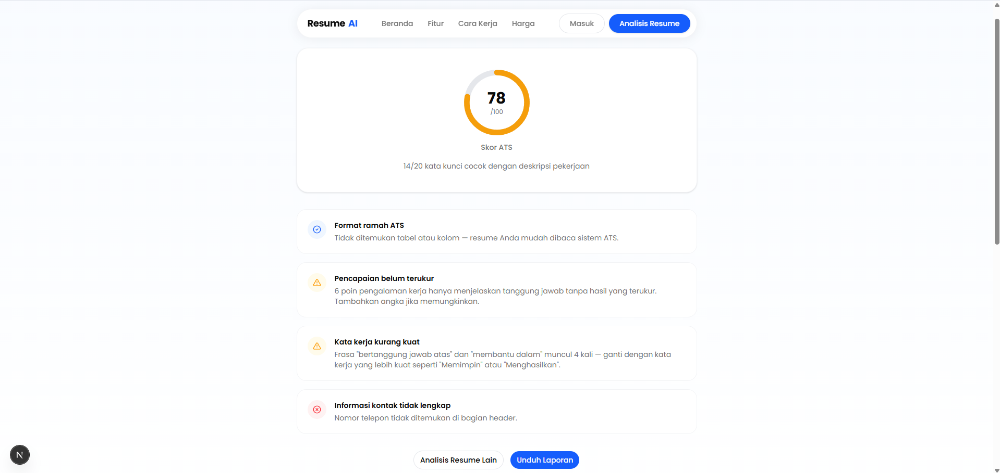

# 🤖 AI Resume Analyzer

**AI Resume Analyzer** is a modern web application designed to help job seekers optimize their resumes/CVs using artificial intelligence. The application analyzes how well a resume matches a specific job description, calculates an ATS (Applicant Tracking System) compatibility score, and provides instant, actionable recommendations for improvement.

Built with the latest technologies such as **Next.js**, **React**, and **Tailwind CSS**, the application delivers a clean, responsive, and user-friendly experience.

---

# 🚀 Key Features

The application provides a simple yet powerful workflow to help users improve their resumes efficiently.

## 1. Modern & Interactive Landing Page

- **Clean UI/UX Design:** Built with the professional Google Poppins font and a modern minimalist layout.
- **Smooth Animations:** Uses **Scroll Reveal** to create elegant entrance animations while scrolling.
- **Seamless Navigation:** Fast client-side navigation without layout breaking or component flashing.

---

## 2. Smart Resume Upload

- **Multiple File Formats:** Supports both **PDF** and **DOCX** resume files.
- **File Size Validation:** Built-in validation with a maximum upload size of **5MB**.
- **Drag & Drop Support:** An intuitive drag-and-drop upload area for a better user experience.

---

## 3. Job Description Matching

- **Context-Aware Analysis:** Users can optionally paste a job description for a more accurate evaluation.
- **Keyword Extraction:** AI compares keywords from the job description against the uploaded resume to determine relevance.

---

## 4. Comprehensive Resume Analysis Dashboard

- **Instant ATS Score:** Displays a visual ATS compatibility score.
- **Actionable Feedback:** Identifies resume strengths, weaknesses, and missing elements.
- **Improvement Suggestions:** Provides personalized recommendations to increase interview opportunities.

---

# 📸 Screenshots

Below are some screenshots of the AI Resume Analyzer application.

## 🔹 Landing Page

The homepage introduces users to the application and highlights its main benefits.



---

## 🔹 Resume Analysis Page (`/analyze`)

The primary workspace where users upload their resume and enter a job description for AI analysis.



---

# 🛠️ Tech Stack

- **Framework:** Next.js (App Router)
- **Frontend:** React
- **Styling:** Tailwind CSS
- **Icons:** Lucide React
- **Fonts:** Google Fonts (Poppins)
- **Animations:** Scroll Reveal
- **Language:** TypeScript

---

# 📁 Project Structure

```text
ai-resume-analyzer/
├── app/                     # App Router (Pages, Layouts & Global CSS)
│   ├── analyze/             # Resume Analysis Page
│   ├── globals.css          # Global Styles & Tailwind CSS
│   └── layout.tsx           # Root Layout
│
├── components/
│   ├── layout/              # Navbar, Footer, Container
│   ├── sections/            # Hero, Features, Pricing, FAQ, etc.
│   └── ui/                  # Reusable UI Components
│
├── public/
│   ├── screenshots/
│   └── images/
│
└── package.json
```

---

# 💻 Getting Started

Follow these steps to run the project locally.

## 1. Clone the Repository

```bash
git clone https://github.com/Metyu5/ai-resume-analyzer.git

cd ai-resume-analyzer
```

## 2. Install Dependencies

Using npm

```bash
npm install
```

or Yarn

```bash
yarn install
```

or pnpm

```bash
pnpm install
```

---

## 3. Start the Development Server

Using npm

```bash
npm run dev
```

or Yarn

```bash
yarn dev
```

or pnpm

```bash
pnpm dev
```

---

## 4. Open Your Browser

Visit:

```
http://localhost:3000
```

to access the application.

---

# 📌 Roadmap

Upcoming features planned for future releases:

- User authentication
- Resume history
- AI-powered resume rewriting
- Cover letter generator
- Multi-language support
- Resume templates
- PDF report export
- AI interview preparation
- Resume version comparison
- Dashboard analytics

---

# 🤝 Contributing

Contributions are welcome!

If you have suggestions, bug reports, or feature requests, feel free to:

- Fork the repository
- Create a feature branch
- Submit a Pull Request
- Open an Issue

Every contribution helps improve the project.

---

# 📄 License

This project is licensed under the **MIT License**.

---

Made with using **Next.js**, **React**, and **Tailwind CSS**, **Laravel API**.
